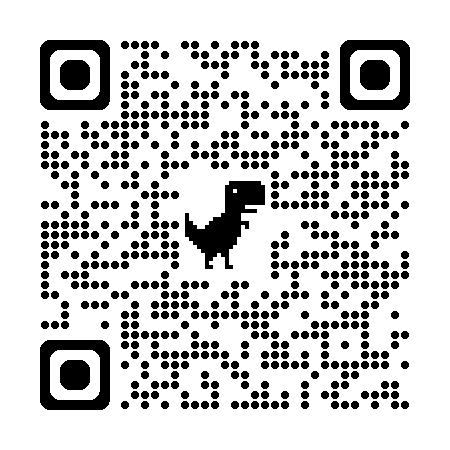

# Page Web avec QR Code

Cette page web élégante et réactive est conçue pour partager un QR code qui redirige directement vers une application. La page est simple mais visuellement attrayante, optimisée pour divers appareils et facile à naviguer.

## Fonctionnalités

### 1. **Design Centré**
- La page est entièrement réactive et centrée à la fois verticalement et horizontalement, assurant un look propre et moderne sur tous les appareils.
- Inclut un en-tête bien stylisé, l’affichage du QR code et un lien direct vers l’application.

### 2. **Style**
- Design minimaliste utilisant du CSS pour :
  - Un fond clair (`#f4f4f9`) avec un texte contrastant (`#333`).
  - Une image de QR code arrondie et ombrée pour une meilleure esthétique visuelle.
  - Des transitions de couleur fluides pour les liens interactifs.

### 3. **Interactivité**
- Un lien cliquable sous le QR code fournit une méthode alternative pour accéder à l’application, le rendant accessible aux utilisateurs qui ne peuvent pas scanner les QR codes.

## Structure du fichier
L’application est composée d’un seul fichier HTML avec du CSS intégré pour le style.

### Décomposition du code
#### Section Head
- Inclut les balises `meta` pour l’encodage des caractères et les paramètres du viewport pour une réactivité mobile.
- Une balise `title` spécifie le but de la page.

#### Section Body
- Contient :
  - Un en-tête (`<h1>`) pour présenter le but de la page.
  - Une image (``) affichant le QR code.
  - Un paragraphe (`<p>`) avec un lien hypertexte cliquable vers l’application.

#### Style CSS
- Intégré dans une balise `<style>` :
  - La mise en page en Flexbox assure le centrage.
  - Schéma de police et de couleurs pour une meilleure lisibilité.
  - Effets de survol sur les liens pour améliorer l’expérience utilisateur.

## Utilisation

### Prérequis
- Une image de QR code (`qrcode_bts-sio-slam-qiuz.streamlit.app.png`) enregistrée dans le même répertoire que le fichier HTML.
- Une URL d’application hébergée (`https://bts-sio-slam-qiuz.streamlit.app`).

### Comment Utiliser
1. Enregistrez le fichier HTML dans votre répertoire local.
2. Assurez-vous que l’image du QR code est nommée `qrcode_bts-sio-slam-qiuz.streamlit.app.png` et placée dans le même répertoire.
3. Ouvrez le fichier dans un navigateur web moderne.

## Personnalisation
- **QR Code** : Remplacez l’attribut `src` de la balise `` par le chemin de votre image QR code souhaitée.
- **URL du Lien** : Mettez à jour l’attribut `href` de la balise `<a>` avec le lien de votre application.
- **Style** : Modifiez le CSS dans la balise `<style>` pour changer les couleurs, les polices ou la mise en page.

## Exemple
```html

<p>Ou <a href="https://bts-sio-slam-qiuz.streamlit.app">cliquez ici</a> pour visiter directement.</p>
```

## Déploiement
- Hébergez le fichier HTML sur un serveur web pour le rendre accessible publiquement.
- Assurez-vous que l’image du QR code est accessible en la plaçant dans le bon répertoire par rapport au fichier HTML.

## Licence
Ce projet est open source et peut être modifié ou distribué sous la licence MIT.

## Auteur
Cette page est conçue pour fournir un moyen facile aux utilisateurs d’accéder à l’application via un QR code ou un lien direct.

